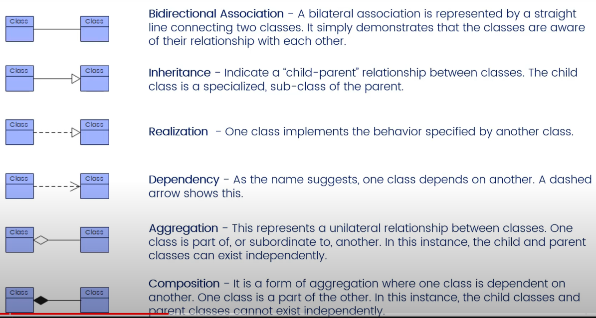
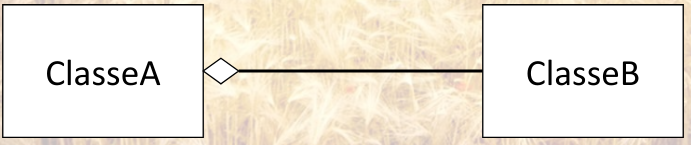
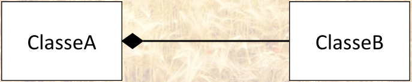
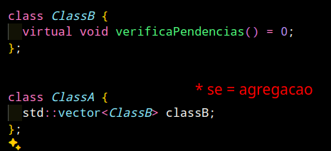
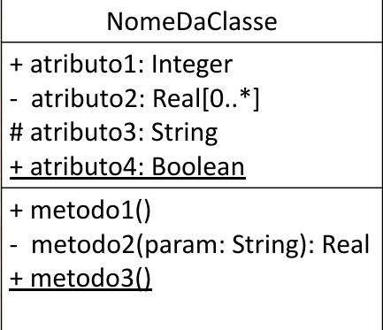

# Principais

### Principais relacoes

### composicao X agregacao

  - Agregacao:
    - uma classe reúne um ***conjunto de objetos*** de outra classe, mas ***sem*** possuir esses objetos
    - Associação binária "fraca"
    - Objetos agregados não dependem da classe agregadora
    - Objetos agregados podem fazer parte de outras classes
    - 

    
  - Composicao:
    - uma classe reúne um ***conjunto de objetos*** de outra classe
    - Associação binária "forte"
    - Objetos componentes dependem da classe composta
    - Objetos componentes não podem fazer parte de outras classes
    - 
    - 
  
### Atributos
